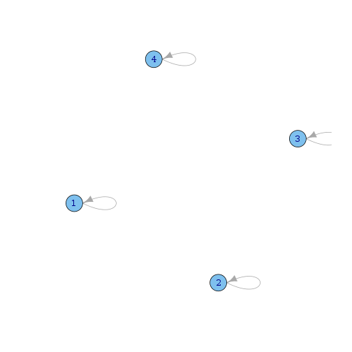
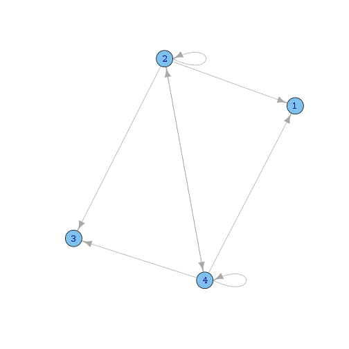
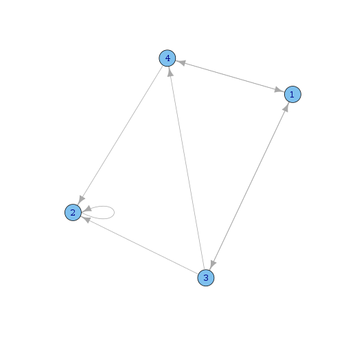

% Network visualization with igraph
% [Keith Hughitt](khughitt@umd.edu)
% 2013/04/11

Overview
========
Just playing around with [igraph](http://igraph.sourceforge.net/).

1. Creating an adjacency matrix
===============================
First, let's try plotting a few different adjaceny matrices. To do so, you can
simply use the `graph.adjaceny` function.


```r
library(igraph)

# Identity matrix (not the most exciting network...)
x = diag(4)
x
```

```
##      [,1] [,2] [,3] [,4]
## [1,]    1    0    0    0
## [2,]    0    1    0    0
## [3,]    0    0    1    0
## [4,]    0    0    0    1
```

```r
plot(graph.adjacency(x))
```

 

```r

# two nodes that are completely connected and two with zero connectivity
y = matrix(rep(c(0, 1), 8), 4, 4)
y
```

```
##      [,1] [,2] [,3] [,4]
## [1,]    0    0    0    0
## [2,]    1    1    1    1
## [3,]    0    0    0    0
## [4,]    1    1    1    1
```

```r
plot(graph.adjacency(y))
```

 

```r

# a random network
set.seed(1)
z <- matrix(sample(0:1, 16, replace = T), 4, 4)
z
```

```
##      [,1] [,2] [,3] [,4]
## [1,]    0    0    1    1
## [2,]    0    1    0    0
## [3,]    1    1    0    1
## [4,]    1    1    0    0
```

```r
plot(graph.adjacency(z))
```

 


