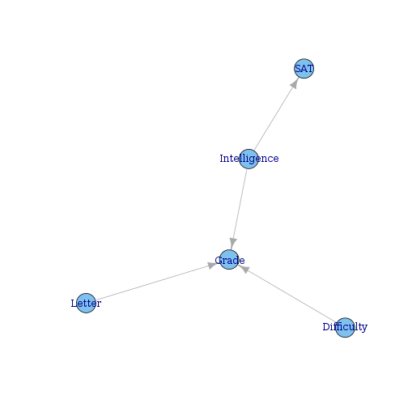

% Probabilistic Graphical Models (Week 1)
% [Keith Hughitt](khughitt@umd.edu)
% 2013/04/17

Overview
========
> A graphical model is a probabilistic model for which a graph denotes the 
> conditional dependence structure between random variables. They are commonly 
> used in probability theory, statistics-particularly Bayesian statistics-and 
> machine learning. (Wikipedia)

Graphs are used to help us represent complex systems with large numbers of
variables.

Graphical models
----------------
There are two main classes of graphical models that will be discussed:

### 1. Bayesian networks
* **Directed** graph
* **Nodes** = Random variables
* **Edges** = Probabilistic connection between RVs: A -> B mean that B depends 
  on A.
  
### 2. Markov networks
* **Undirected** graph
* AKA "Markov random field" (MRF)
* **Nodes** = Random variables with the [markov property](http://en.wikipedia.org/wiki/Markov_property)

### Real-world examples
* CPCS - Bayesian network used for medical diagnosis.
* Image segmentation method with nodes representing labels of superpixels and
  edges representing probabilistic relationship between adjacent superpixels.

Class outline
-------------
### 1. Representation
- Directed and undirected
- Temporal and plate models

### 2. Inference
- Exact and approximate
- Decision Making

### 3. Learning
- Parameters and structure
- With and without complete data

Probability Distributions
=========================

Joint Distribution
------------------
Probability distribution of two or more random variables.

### Independence parameters
Independence parameters are parameters whose value is not completely determined
by the values of other parameters.

### Conditioning
Given a probability distribution, we can **condition** the probability 
distribution on a particular observation.

To do this, we choose a value for one of the random variables that make up
the distribution, and only consider parameter combinations which include that
particular value.

This **reduced** distrubtion can then be normalized to produce a new distribution:

$$P(I, D, G) => P(I, D, g^1) => P(I, D | g^1)$$

For example, this can be used when we know (e.g. have observed) the value of one
of the parameters in the distribution.

### Marginalization

In marginalization, we are going from one joint PDF to a PDF with a smaller
number of parameters. To do this, we sum over all the possible probabilities
for the parameter we are marginalizing. e.g.:

$$P(I, D, G) => P(I, D)$$

Factors
=======

A factor is a ``function'' or a ``table'' which maps from some set of random
variables to a single value. Factors map from all possible combinations of 
the values of those RVs, e.g.

$$ \phi(X_1, X_2, \ldots, X_n) \mapsto \mathbb{R} $$

The **scope** of a factor is the set of arguments (the RVs that can vary) for
the factor.

For example, probability density functions are a type of factor: given a
combination of values for each parameter in the PDF, a single real-valued
number (in this case, a probability) is returned.\\

**Conditional Probability Distributions (CPD)** are an important type of factor.

Factor Product
--------------
Multiplying two factors together gives a factor product. It is a similar 
operation to multiplying to functions together. Resulting scope is the union
of the scopes of the input factors.

Factor marginalization
----------------------
Similar to marginalization of PDFs.

Factor Reduction
----------------
Similar to conditioning of PDFs.

Why Factors?
------------
Factors are the basic units used to build PDFs in high-dimentional spaces.

Bayesian Networks
=================

Semantics & Factorization
-------------------------

### Student example

Given a student taking a class for a grade, we have the following random
variables:

- **G**rade
- Course **D**ifficulty
- Student **I**ntelligence
- Student **S**AT
- Reference **L**etter

$$P(G, D, I, S, L)$$

To keep things simple, we will consider each of these (except for Grade) to be
a binary RV.\\

### Constructing dependencies:


```r
library(igraph)
edgelist = matrix(c("Difficulty", "Grade", "Intelligence", "Grade", "Intelligence", 
    "SAT", "Letter", "Grade"), nc = 2, byrow = TRUE)
network = graph.edgelist(edgelist)
plot(network)
```

 


Here the student's grade depends on the course difficulty and the student
intelligence. SAT score depends on intelligence. Recommendation letter depends
on grade.

###  Representing a PDF

To go from our above model which shows dependencies between different random
variables to a probability distribution, we can annotate each node in the
network with a conditional probability distribution (CPD).
* For simple cases (e.g. difficulty) which have no dependencies, the CPD
is just a table with the probabilities for each possible outcome (i.e. an
unconditional probability distribution)
* For nodes that depend on other nodes, the table must include the probabilies
for that RV conditioned on the other RVs.

So for the above network, we have: **P(D), P(I), P(G|I, D), P(S|I), P(L|G)**

### Chain Rule for Bayesian Networks
To get the joint PDF for the entire network we can simply multiply the CPDs for
each of the nodes:\

**P(D,I,G,S,L) = P(D) P(I) P(G|I,D) P(S|I) P(L|G)**

...This is a **factor product**!

### Definition of a Bayesian Network

* A directed acyclic graph (DAG) $G$ whose nodes represent the random variables
  $X_1, \ldots, X_n$
* For each node $X_i$ a CPD $P(X_i|Par_G(X_i))$
* The BN represents a joint distribution via the chain rule for Bayesian 
  networks.
* BN is a legal distrubtion $\iff \sum P = 1$

We say that a distribution $P$ **factorizes over** $G$ if:
$$P($X_1, \ldots, X_n$) = \prod_i P(X_i|Par_G(X_i))$$


References
==========
- Daphne Koller, (2013) Probabilistic Graphical Models. *Coursera* [(Course Website)](https://www.coursera.org/course/pgm)
- Edoardo M. Airoldi, (2007) Getting Started in Probabilistic Graphical Models.  *Plos Computational Biology*  **3**  [10.1371/journal.pcbi.0030252](http://dx.doi.org/10.1371/journal.pcbi.0030252)
