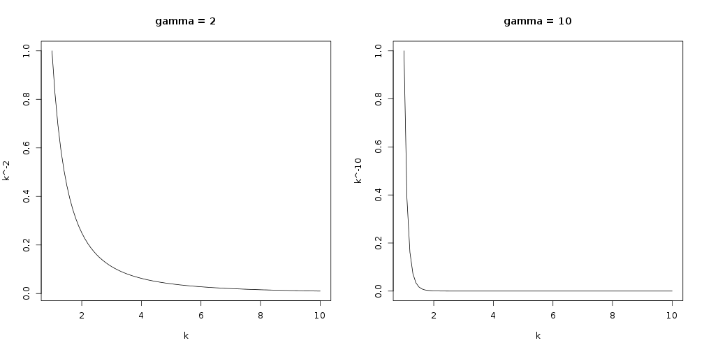
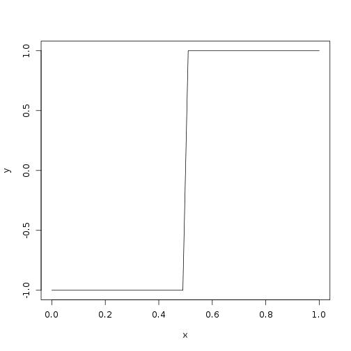
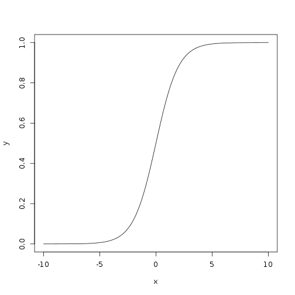

% Co-expression Networks
% [Keith Hughitt](khughitt@umd.edu)
% 2013/04/11

Overview
========
Going through some of the co-expression network papers and putting together
notes... Will have to think a little more about how much time I want to put
in to producing these notes.

Background
==========

Scale-free networks
-------------------
Many biological networks (including co-expression networks) are thought to
follow a [power law distribution](https://en.wikipedia.org/wiki/Power_law)^1.

For co-expression networks with genes as nodes, the degree distribution $p(k)$
for genes follows:

$$
p(k) \sim k^{-\gamma}
$$

where $k$ is the number of connections to other genes.

The exponent $\gamma$ determines how quickly the distribution decays,
for example:


```r
layout(t(1:2))

# gamma = 2
k = seq(1, 10, by = 0.1)
plot(k, k^-2, type = "l")
title("gamma = 2")

# gamma = 10
plot(k, k^-10, type = "l")
title("gamma = 10")
```

 


Co-expression Network Construction
==================================

1. Select a similarity metric
-----------------------------
The first step towards constructing a co-expression network is to choose a
similarity metric to weight the relationship between two nodes (genes) in the 
network, based on their expression profiles.

Each pair of genes is then evaluated using the metric, and an $n \times n$ **similarity 
matrix** is generated.

2. Create an adjacency matrix
-----------------------------
Next, the similarity is converted to an [adjaceny matrix](http://en.wikipedia.org/wiki/Adjacency_matrix).
An adjaceny function is chosen which maps from the similarity values to edge
weights.

*** hard-threshold
A hard-threshold can be chosen s.t. all edges are given a weight of either 0
or 1, depending on whether they are below or the specified threshold. This is
done using the [sign (signum) function](http://en.wikipedia.org/wiki/Signum_function):

$$
a_{ij} = signum(s_{ij}, \tau) \equiv \left\{ 
  \begin{array}{l l}
    1 & \quad \text{if} s_{ij} \ge \tau \\
    0 & \quad \text{if} s_{ij} \le \tau
  \end{array}
\right.
$$

Example ($\tau = 0.5$)

```r
x = seq(0, 1, by = 0.01)
y = sign(-0.5 + x)
plot(x, y, "l")
```

 


This results in an unweighted network.

*** soft-threshold

To enable the representation of a wider range of relationships between genes,
WGCNA proproses the use of one of two types of adjacency functions:

i. the [sigmoid function](http://en.wikipedia.org/wiki/Sigmoid_function) (with parameters
$\tau_0$ and $\alpha$:

$$
a_{ij} = sigmoid(s_{ij}, \alpha, \tau_0) \equiv \frac{1}{1 + e^{-\alpha(s_{ij} - \tau_0)}}
$$

Example ($\alpha = 1, \tau_0 = 0$)


```r
x = seq(-10, 10, by = 0.1)
y = 1/(1 + exp(-x))
plot(x, y, "l")
```

 


ii. The single-parametered power function:

$$
a_{ij} = power(s_{ij}, \beta) \equiv |s_{ij}|^\beta
$$


3. Module identification
------------------------
Once an adjacency matrix has been constructed, a measure of dissimilarity
(distance) can be defined, and this can be used for clustering.


References
==========
1. Bin Zhang, Steve Horvath,   (2005) A General Framework For Weighted Gene co-Expression Network Analysis.  *Statistical Applications in Genetics And Molecular Biology*  **4**  [10.2202/1544-6115.1128](http://dx.doi.org/10.2202/1544-6115.1128)>
