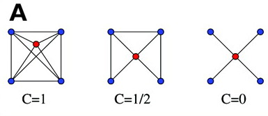

% Module 4: Topological Models and Network Evolution
% [Keith Hughitt](khughitt@umd.edu)
% 2013/10/20

Topological Models and Network Evolution
========================================

Small-World and Scale-Free Networks
-----------------------------------

## Background

### Erdős-Rényi Random Networks
* Erdős and Rényi studied networks with randomly connected nodes (1959).
* For example, place some buttons on a table and then connect buttons with
  random connections.
* Showed that degree distribution for random networks follow a Poisson 
  (~Normal) distribution.

### "Real" Networks are "Small World"
* Duncan Watts and Steve Strogatz showed that real world systems follow 
  **small world** topology (1998).
* Real world system are *not* random but instead they have:
 1. High clustering coefficients ($C$), and,
 2. Relatively short characteristic path lengths ($L$).

Looked at three complex systems:
 * IMDB (movies)
 * Powergrid systems
 * Neuronal connectivity map of *C. elegans*

### Clustering Coefficient

- A measure of how the *neighbors* of a node are connected to each other.
- It represents the degree to which nodes in a graph tend to cluster together.

*Ravasz et al. 2002*

* **C=1**   All neighbors are connected
* **C=1/2** Neighbors have half of the total possible connections
* **C=0**   No neighbors are connected to one another

### Characteristic Path Length

The average shortest distance between all possible pairs of nodes in a network.

### Creating small-world networks

1. Start with a regular lattice
2. Gradually randomize connections by taking an edge and moving it to a random
   location.
3. Along the way to a completely random network, somewhere in the middle you 
   end up with a small-world network.
 - At this point you still have a high clustering coefficient but a short
   characteristic path length.

These "small world" networks fall about fall way between a completely connected
network and a complete randomized network. (Watts and Strogatz, 1998)

### Rich-Get-Richer network growth model
Real world network degree distribution follows power-law distribution 
(**scale-free**) and not a poisson distribution (Barabasi and Albert; 1999).

To construct such a network:
* Start with a few randomly connected nodes
* Start adding new nodes and links to the system:
 - Adding randomly will result in Erdős-Rényi random network.
 - In Rich-get-richer model, new nodes are added with a varying probability
   based on existing nodes.
* Stop once it reaches your desired size.

### Power-law distribution as a result of diverse agents

Many complex systems tend to have this scale-free property. When comparing
similar things, likely get Normal distribution. When you have more diverse
agents, however, more likely to get a power-law distribution (e.g. building
heights in NYC).

* Complex systems are made of "diverse agents"
* These agents play a different role in the network
* Some argue that the power-law distribution is not a *feature* of the network
per say, but rather just a result of having diverse agents.

### Hub nodes

* In a scale-free network you have a few very highly-connected nodes; small
proportion of total network, but much higher than for random networks.
* In scale-free networks, there is sometimes a drop in hubs: they do not
grow infinitely large.
* This may be due to a limit, either physical or temporal ("aging") on the 
nodes (e.g. max height for a building.)

Duplication-Divergence and Network Motifs
-----------------------------------------

## Survival of the fittest

- An agent's fitness determines its ability to survive and spread.
- Agent-fitness depends on many different factors (longevity, mobility, etc).
- Hubs in complex systems tend to be the most fit.
- **Processivity** - once a process is started it takes less energy to keep
  it going.

## Duplication-divergence

Growth by duplication and divergence is very common among complex systems.
- Examples: different types of browsers, search engines, or similar car models.
- Duplication-divergence model is an alternative model capable of generating
  scale-free networks that is **more relevant to biology**
 - *e.g.* Protein-protein interaction networks (Vazquez et al. 2003)

**Duplication-divergence Network Growth model**:

1. Start with random seeds
2. Add new nodes by duplicating and existing node
3. Remove new nodes with probability $p$

## Network Motifs

Milo et al. looked at motifs found in real *directed* networks which
occur at a higher probability than would be expected in similar-sized random
networks (Milo et al. 2002)
- Created random (Erdos-Renyi) networks
- Counted the number of times they see "short circuits" (~3-4 nodes) connecting
  several nodes in a particular way in *actual* networks.
- Found that some of those short circuits occur at much higher rates in
  real-world networks than the random networks.
- Examples
 - Feed-forward loop
 - Bi-fan
- Both of the above examples are likely products of duplication-divergence.

**Graphlets** - motifs in undirected networks (Wuchty et al. 2003)

Large Size Motifs and Complex Models of Network Evolution
---------------------------------------------------------

It is also interesting to look for larger network motifs (e.g. 5 nodes or 
more), however, this is computationally challenging.

## Ordered Cyclic Motifs (Ma'ayan et al. 2010)

- To get around the problem of there being a very large number of possible 
  motifs containing more than a few nodes in mixed graphs, Ma'ayan et al. 
  decided to focus on cycles.
- Classified nodes in these cycles into three types:
 1. **sink nodes** - two incoming arrows
 2. **source nodes** - two outgoing arrows
 3. **pass-through nodes** - one arrow in, one arrow out
 4. **neutral nodes** - nodes with at least one undirected adjacent edge.
- Looked at nine real-world technological and biological directed and mixed 
  networks.
 - In biological networks you find many more sources and sinks in the cycles
   than what you would expect at random.
 - FAA is closer to random - same number of sources and sinks as pass-through
   nodes.
 - For some of the networks, as the loop size changes, the propensity for
   different types of nodes changes.
- Simulations showed that these networks are more stable compared with random
  networks.
- Stability due to the increased levels of sources and sinks.

## Magnetization Model (MacArthur, Ma'ayan et al. 2010)

1. Start with Erdos-Renyi random network
2. Swap links to enrich network in sources and sinks
3. Using a set of simple rules that couple the swapping of links to increase
   sources and sinks to dynamical stability, arrived at networks with many
   of the properties of real-world biochemical networks.
4. **Adjacency matrix eigenvalues $\sim$ network stability**

## Hierarchical Organization of Pathways from Ligands (Ma'ayan et al. 2006)
- Another model for network evolution/growth.
- Goal is to create a model that grows networks in a way where the network
can interact with and try to adapt to environmental conditions as it grows.

Network Properties of Biological Networks
-----------------------------------------

## Hub Proteins

### Types of Hubs

1. **Party hubs** - network hubs that interact with genes at same time and
   space.
2. **Date hubs** - network hubs that interact with many genes but at different
   times or different locations (->multifunctional)

Another classification for PPI network hub proteins (Kim et al. 2006)

1. **Multisite hubs** ~ party hubs: scaffolding proteins that can be interact
with many proteins at once.
2. **Single site hubs** ~ date hubs: typically enzymes or other types of
proteins that are more promiscuous in their ability to bind to multiple 
partners at the same binding site (e.g. kinases, actin, etc.)

## Bow-ties
* Cell signaling networks are often organized in this fashion (Oda and Kitano, 
2006).
* Many receptors (e.g. TLRs, tyrosine kinase receptors) share the same molecule
that transduce the signal from receptor to effector; although receptor may be
different, there are shared adaptor proteins (e.g. MyD88 for TLRs).
* Once information is consolodated at adaptor, network fans out again, with
many possible targets.

## Bifans
* Most abundant biological network motif

## Feedback loops
* Negative feedback loops enriched at membrane while positive feedback loops
are more common further into the cytoplasm.

References
----------
1. http://en.wikipedia.org/wiki/Clustering_coefficient
2. Duncan J. Watts, Steven H. Strogatz,   (1998) Unknown.  *Nature*  **393**  440-442  [10.1038/30918](http://dx.doi.org/10.1038/30918)
3. E. Ravasz,   (2002) Hierarchical Organization of Modularity in Metabolic Networks.  *Science*  **297**  1551-1555  [10.1126/science.1073374](http://dx.doi.org/10.1126/science.1073374)

