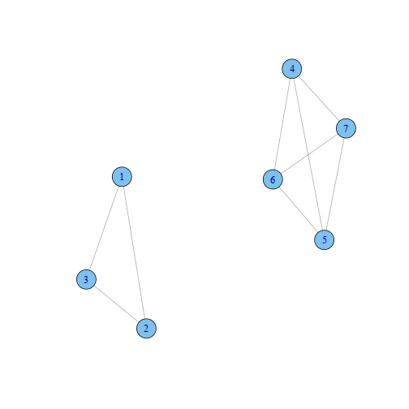

% Introduction to Graph Theory
% Keith Hughitt
% 2013/11/06

Introduction
============

1.1 Graphs and Graph Models
---------------------------

## Graph definition
- A graph $G$ consists of a finite nonempty set $V$ of objected call *vertices*
  and  a set $E$ of *2-element subsets* of $V$ called **edges**.
- $V$ and $E$ are the **vertex set** and **edge set**; can also write as $V(G)$
  and $E(G)$ to emphasize that they are the vertex and edge sets of graph $G$
- $G$ is the *ordered* set containing $V$ and $E$
- Two graphs $G$ and $H$ are *equal* if both their node and edges sets are 
  equal.
- Although graphs are defined in terms of sets, it is often convenient or 
  meaningful to represent them as diagrams.

## Properties

- An edge between nodes $u$ and $v$ may be represented as ${u,v}$ or $uv$.
- If $uv$ is an edge in $G$, then $u$ and $v$ are said to be **adjacent**
- **order** = # nodes
- **size** = # edges
- A graph with exactly one vertex is called a **trivial** graph. All other
  graphs are **nontrivial**.
- Graphs can be **labeled** or **unlabeled**

## Examples
- **Word graphs** each nodes in the graph represents a word. Adjacent nodes
  are nodes with a single character changed.

1.2 Connected Graphs
--------------------

## Terminology

**Vertices and Edges**
- If $e = uv$ is an edge of $G$, $u$ and $v$ are **joined** by the edge $e$.
- The vertices $u$ and $v$ are said to be **neighbors** of each other.
- Vertices and their neighboring edges are **incident** with each other.
- Edges that share a vertex are **adjacent edges**.

**Subgraphs**
- $H \subseteq G \iff V(H) \subseteq V(G) \text{and} E(H) \subseteq E(G)$
- $H$ is a subgraph of $G$
- $G$ contains $H$ as a subgraph

**Proper subgraphs**
- If $H \subseteq G$ and either $V(H)$ is a proper subset (it must be missing
  at least one of the items in the original set) of $V(G)$ or $E(H)$ is a 
  proper subset $E(G)$, then $H$ is a proper subgraph of $G$.
- *i.e.* it is a subgraph with some differences from the original graph ($G$
  is a subgraph of itself, but not a proper subgraph.)
- Any proper subgraph of graph $G$ can be obtained by removing vertices and
  edges from $G$ (e.g. $G - e_1 - e_2 \ldots - e_k$)

**Spanning subgraph**
A subgraph with the same vertex set as its parent graph.

**Induced subgraph**
-A subgraph which contains all edges present in the parent graph for those
vertices included in the subgraph.
-i.e. Whenever $u$ and $v$ are in the subgraph $f$ and $uv$ is in the $G$, then
 $uv$ is also in $F$
- The *subgraph of G induced by $S$* is the induced subgraph for the nonempty
set of vertices $S$.
- The *subgraph G[X] induced by X* is the induced subgraph for the non-empty
edge set $X$. This is called a **edge-induced subgraph** of G.
- Alt. notation: $\langle S \rangle_G$ = $G[S]$

## Traversal Terminology

- A **walk** $W$ in $G$ is a sequence of vertices in $G$ beginning with $u$
and ending at $v$ s.t. consecutive vertices in the sequence are adjacent.
- **closed walk**: $u = v$
- **open walk**: $u \neq v$
- **length** of a walk = the number of edges (including multiple occurences
of the same edge) traversed.
- A **trail** is a walk where no *edge* is traversed more than once (nodes can
be traversed more than once though.)
- A **path** is a walk where no *vertex* is visited more than once.

**Theorem 1.6**
*If a graph $G$ contains a $u - v$ alk of length $l$, then $G$ contains a $u -
v$ path of length at most $l$.

- A **circuit** in graph $G$ is a closed *trail* of length 3 or more.
- A **cycle** is a circuit where no vertex (except the first/last) is repeated.
- A **$k$-cycle** is a cycle of length $k$.

## Connectedness
- If *G* contains a $u-v$ path, then $u$ and $v$ are said to be **connected**
and $u$ **is connected to** $v$.
- A graph $G$ is **connected** if every two vertices of $G$ are connected.
- A graph $G$ that is not connected is called **disconnected**.
- A connected subgraph of $G$ that is not a proper subgraph of any other
connected subgraph of $G$ is a **(connected) component** of $G$.
- $k(G)$ = # of components of a graph $G$

Example: two connected components

```r
library(igraph)
x = matrix(0, 7, 7)
x[0:3, 0:3] = 1
x[4:7, 4:7] = 1
plot(graph.adjacency(x, mode = "undirected"))
```

 


References
----------
- Gary Chartrand,   (2012) A first course in graph theory.
- http://mathworld.wolfram.com/ProperSubset.html

